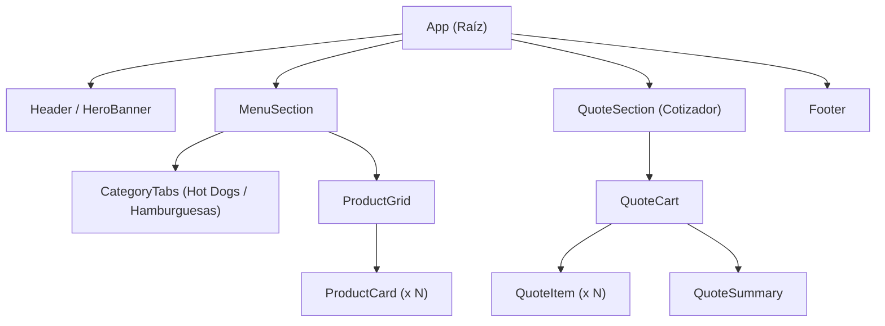
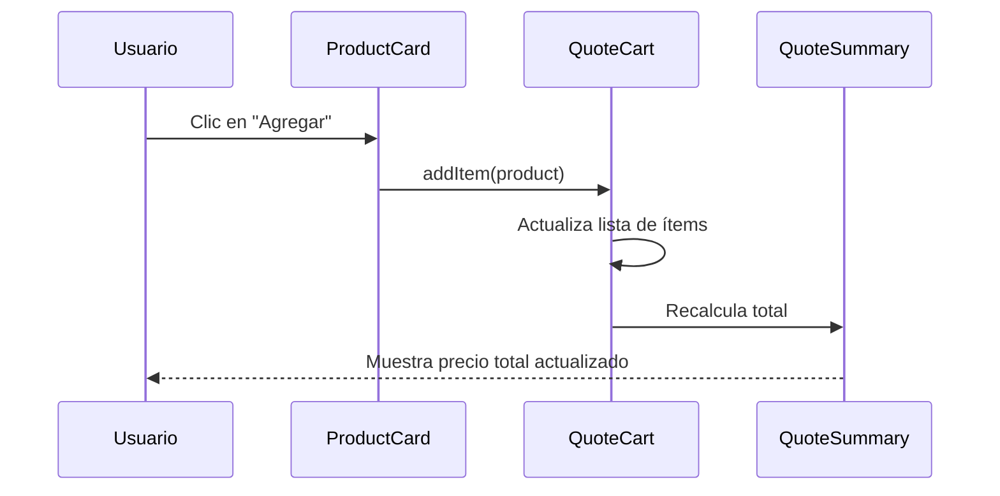
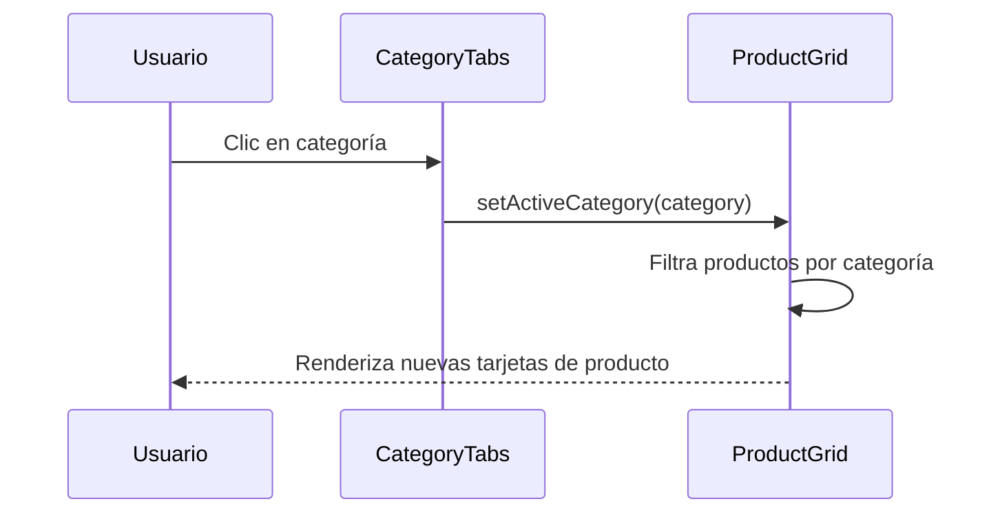

# Documento de Diseño: fast-food-menu

## Descripción General

Página web frontend en React JSX para la visualización y cotización de comidas rápidas (perros calientes y hamburguesas) con estilo publicitario llamativo. La aplicación permite al usuario explorar el menú visual, ver precios y generar un resumen de cotización de los productos seleccionados.

La interfaz adopta estética de fast food publicitario: colores vibrantes (rojo, amarillo, naranja), tipografías bold, imágenes de productos destacadas y animaciones sutiles que refuerzan el atractivo visual. No requiere backend; todos los datos del menú están definidos localmente en el frontend.

## Arquitectura



## Diagramas de Secuencia

### Flujo: Agregar producto a la cotización



### Flujo: Cambiar categoría del menú



## Componentes e Interfaces

### Componente: App

**Propósito**: Raíz de la aplicación. Gestiona el estado global de la cotización.

**Interfaz**:
```tsx
// Estado global manejado en App
interface AppState {
  quoteItems: QuoteItem[]
}

// Props: ninguna (componente raíz)
const App: React.FC = () => { ... }
```

**Responsabilidades**:
- Proveer estado del carrito de cotización
- Pasar callbacks `addItem` / `removeItem` / `updateQuantity` a componentes hijos

---

### Componente: HeroBanner

**Propósito**: Banner publicitario principal con llamada a la acción.

**Interfaz**:
```tsx
interface HeroBannerProps {
  title: string
  subtitle: string
  ctaLabel: string
  onCtaClick: () => void
}
```

**Responsabilidades**:
- Mostrar imagen de fondo llamativa (estilo fast food)
- Renderizar título, subtítulo y botón CTA
- Scroll suave al menú al hacer clic en CTA

---

### Componente: CategoryTabs

**Propósito**: Pestañas para filtrar el menú por categoría.

**Interfaz**:
```tsx
type Category = 'hotdogs' | 'hamburgers' | 'all'

interface CategoryTabsProps {
  activeCategory: Category
  onCategoryChange: (category: Category) => void
}
```

**Responsabilidades**:
- Renderizar tabs visuales para cada categoría
- Emitir evento de cambio de categoría al padre

---

### Componente: ProductCard

**Propósito**: Tarjeta visual de un producto del menú.

**Interfaz**:
```tsx
interface ProductCardProps {
  product: Product
  onAdd: (product: Product) => void
}
```

**Responsabilidades**:
- Mostrar imagen, nombre, descripción corta y precio del producto
- Botón "Agregar al cotizador"
- Animación hover tipo publicidad

---

### Componente: QuoteCart

**Propósito**: Panel de cotización con ítems seleccionados.

**Interfaz**:
```tsx
interface QuoteCartProps {
  items: QuoteItem[]
  onRemove: (productId: string) => void
  onUpdateQuantity: (productId: string, quantity: number) => void
}
```

**Responsabilidades**:
- Listar ítems cotizados con cantidad y subtotal
- Permitir modificar cantidad o eliminar ítem
- Mostrar total acumulado

---

## Modelos de Datos

### Product

```tsx
interface Product {
  id: string
  name: string
  description: string
  price: number          // En la moneda local (ej: COP)
  category: 'hotdogs' | 'hamburgers'
  imageUrl: string
  badge?: string         // Ej: "Nuevo", "Más pedido", "Especial"
}
```

**Reglas de validación**:
- `price` debe ser mayor que 0
- `name` no puede estar vacío
- `category` solo acepta los valores definidos en el union type

---

### QuoteItem

```tsx
interface QuoteItem {
  product: Product
  quantity: number       // Mínimo 1
}
```

**Reglas de validación**:
- `quantity` >= 1
- El mismo producto no se duplica: se incrementa `quantity`

---

### Datos del Menú (Estáticos)

```tsx
const MENU_DATA: Product[] = [
  // Hot Dogs
  { id: 'hd1', name: 'Perro Clásico', description: 'Salchicha, mostaza, kétchup y cebolla', price: 8000, category: 'hotdogs', imageUrl: '/images/hotdog-classic.jpg', badge: 'Más pedido' },
  { id: 'hd2', name: 'Perro Especial', description: 'Doble salchicha, queso, piña y salsas', price: 12000, category: 'hotdogs', imageUrl: '/images/hotdog-special.jpg', badge: 'Especial' },
  { id: 'hd3', name: 'Perro Ranchero', description: 'Salchicha, tocineta, maíz y aderezo ranch', price: 13500, category: 'hotdogs', imageUrl: '/images/hotdog-ranch.jpg' },
  // Hamburguesas
  { id: 'hb1', name: 'Hamburguesa Clásica', description: 'Carne, lechuga, tomate y mayonesa', price: 14000, category: 'hamburgers', imageUrl: '/images/burger-classic.jpg', badge: 'Más pedido' },
  { id: 'hb2', name: 'Hamburguesa BBQ', description: 'Doble carne, tocineta, cheddar y salsa BBQ', price: 19000, category: 'hamburgers', imageUrl: '/images/burger-bbq.jpg', badge: 'Nuevo' },
  { id: 'hb3', name: 'Hamburguesa Pollo Crispy', description: 'Pollo apanado, coleslaw y salsa especial', price: 16000, category: 'hamburgers', imageUrl: '/images/burger-chicken.jpg' },
]
```

---

## Pseudocódigo Algorítmico

### Algoritmo: Gestión del carrito de cotización

```pascal
ALGORITHM addToQuote(quoteItems, product)
INPUT: quoteItems: QuoteItem[], product: Product
OUTPUT: newQuoteItems: QuoteItem[]

PRECONDITION: product.price > 0 AND product.id IS NOT NULL

BEGIN
  existingItem ← FIND item IN quoteItems WHERE item.product.id = product.id
  
  IF existingItem IS NOT NULL THEN
    RETURN quoteItems MAP (item →
      IF item.product.id = product.id THEN
        { ...item, quantity: item.quantity + 1 }
      ELSE
        item
      END IF
    )
  ELSE
    RETURN [...quoteItems, { product: product, quantity: 1 }]
  END IF
END

POSTCONDITION:
  - newQuoteItems.length >= quoteItems.length
  - El producto existe en newQuoteItems con quantity >= 1
  - No hay productos duplicados en newQuoteItems
```

```pascal
ALGORITHM removeFromQuote(quoteItems, productId)
INPUT: quoteItems: QuoteItem[], productId: string
OUTPUT: newQuoteItems: QuoteItem[]

BEGIN
  RETURN quoteItems FILTER (item → item.product.id ≠ productId)
END

POSTCONDITION:
  - newQuoteItems.length = quoteItems.length - 1 (si productId existía)
  - El producto con productId NO existe en newQuoteItems
```

```pascal
ALGORITHM calculateTotal(quoteItems)
INPUT: quoteItems: QuoteItem[]
OUTPUT: total: number

BEGIN
  total ← 0
  
  FOR each item IN quoteItems DO
    INVARIANT: total >= 0
    subtotal ← item.product.price * item.quantity
    total ← total + subtotal
  END FOR
  
  RETURN total
END

POSTCONDITION:
  - total >= 0
  - total = Σ (item.product.price × item.quantity) para todo item en quoteItems
```

---

## Funciones Clave con Especificaciones Formales

### `addToQuote(quoteItems, product)`

```tsx
function addToQuote(quoteItems: QuoteItem[], product: Product): QuoteItem[]
```

**Precondiciones:**
- `product` no es null/undefined
- `product.price > 0`
- `product.id` es un string no vacío

**Postcondiciones:**
- El array retornado contiene exactamente un ítem con `product.id`
- Si el producto ya existía: `quantity` incrementado en 1
- Si es nuevo: ítem agregado con `quantity = 1`
- No hay efectos secundarios sobre el array original (inmutabilidad)

**Invariante de loop:** No aplica (operación sobre array con map/filter)

---

### `calculateTotal(quoteItems)`

```tsx
function calculateTotal(quoteItems: QuoteItem[]): number
```

**Precondiciones:**
- `quoteItems` es un array (puede estar vacío)
- Cada `item.quantity >= 1`
- Cada `item.product.price > 0`

**Postcondiciones:**
- Retorna número >= 0
- Si `quoteItems` está vacío, retorna 0
- `total === quoteItems.reduce((acc, i) => acc + i.product.price * i.quantity, 0)`

**Invariante de loop:** `total >= 0` en cada iteración

---

## Ejemplo de Uso

```tsx
// Inicialización del estado en App
const [quoteItems, setQuoteItems] = useState<QuoteItem[]>([])

// Agregar producto
const handleAddProduct = (product: Product) => {
  setQuoteItems(prev => addToQuote(prev, product))
}

// Eliminar producto
const handleRemove = (productId: string) => {
  setQuoteItems(prev => removeFromQuote(prev, productId))
}

// Calcular total para mostrar en QuoteSummary
const total = calculateTotal(quoteItems)

// Renderizado principal
return (
  <div className="app">
    <HeroBanner
      title="🌭 La mejor comida rápida"
      subtitle="Perros calientes y hamburguesas que te volarán la cabeza"
      ctaLabel="Ver Menú"
      onCtaClick={() => scrollToMenu()}
    />
    <MenuSection
      products={MENU_DATA}
      onAddToQuote={handleAddProduct}
    />
    <QuoteCart
      items={quoteItems}
      onRemove={handleRemove}
      onUpdateQuantity={handleUpdateQuantity}
    />
  </div>
)
```

---

## Propiedades de Corrección

- Para todo producto `p` en `MENU_DATA`: `p.price > 0` y `p.id` es único
- Para todo `QuoteItem` en el carrito: `quantity >= 1` y `product` referencia un producto válido del menú
- `calculateTotal([]) === 0`
- Agregar el mismo producto dos veces resulta en un solo ítem con `quantity = 2` (no duplicados)
- Eliminar un producto que no existe en el carrito deja el carrito sin cambios
- El total nunca es negativo

---

## Manejo de Errores

### Escenario 1: Producto sin imagen disponible

**Condición**: `imageUrl` apunta a una imagen que no carga
**Respuesta**: Mostrar imagen placeholder con ícono de comida y fondo de color de la categoría
**Recuperación**: ` e.currentTarget.src = '/images/placeholder.jpg'} />`

---

### Escenario 2: Carrito vacío al intentar ver cotización

**Condición**: El usuario abre el panel de cotización sin haber agregado productos
**Respuesta**: Mostrar mensaje "Agrega productos para ver tu cotización" con ícono amigable
**Recuperación**: Mostrar botón "Ver Menú" que hace scroll al grid de productos

---

### Escenario 3: Cantidad inválida en QuoteItem

**Condición**: `quantity` llega a 0 al decrementar
**Respuesta**: Eliminar el ítem automáticamente del carrito en lugar de permitir `quantity = 0`
**Recuperación**: `if (newQuantity <= 0) removeFromQuote(productId) else updateQuantity(productId, newQuantity)`

---

## Estrategia de Testing

### Pruebas Unitarias

- `addToQuote`: producto nuevo, producto existente (incremento), inmutabilidad del array original
- `removeFromQuote`: producto existente, producto inexistente, array vacío
- `calculateTotal`: array vacío, un ítem, múltiples ítems, cantidades mayores a 1

### Pruebas Basadas en Propiedades (Property-Based Testing)

**Librería**: fast-check

- Para cualquier lista de productos y cualquier secuencia de `addToQuote`, no deben existir duplicados (por id) en el carrito
- Para cualquier `QuoteItem[]` válido, `calculateTotal` nunca retorna valor negativo
- Para cualquier carrito, `removeFromQuote(addToQuote(cart, p), p.id)` resulta en un carrito con la misma cantidad del producto que antes (o sin el producto si no estaba)

### Pruebas de Integración / Componente

- Renderizado de `ProductCard`: muestra nombre, precio y badge correctamente
- `QuoteCart` refleja cambios al agregar/eliminar productos
- `CategoryTabs` filtra correctamente el `ProductGrid` al cambiar de categoría

---

## Consideraciones de Rendimiento

- Los datos del menú son estáticos (array en memoria), sin necesidad de llamadas a API
- Las imágenes se pueden optimizar con atributo `loading="lazy"` en los ``
- El estado del carrito se maneja con `useState` local en `App`; no se necesita Context ni Redux dado el alcance de la aplicación

---

## Consideraciones de Seguridad

- No hay entrada de usuario libre que procese HTML (no riesgo XSS)
- Los precios se calculan del lado del cliente desde datos estáticos confiables
- Sin autenticación ni datos sensibles en esta versión frontend-only

---

## Dependencias

| Dependencia | Versión sugerida | Uso |
|---|---|---|
| react | ^18.x | Framework UI |
| react-dom | ^18.x | Renderizado DOM |
| vite | ^5.x | Build tool y dev server |
| @vitejs/plugin-react | ^4.x | Soporte JSX/TSX en Vite |
| typescript | ^5.x | Tipado estático (opcional pero recomendado) |

> Todas las dependencias de estilo se manejan con CSS puro / CSS Modules para mantener el proyecto sin dependencias adicionales de UI.
